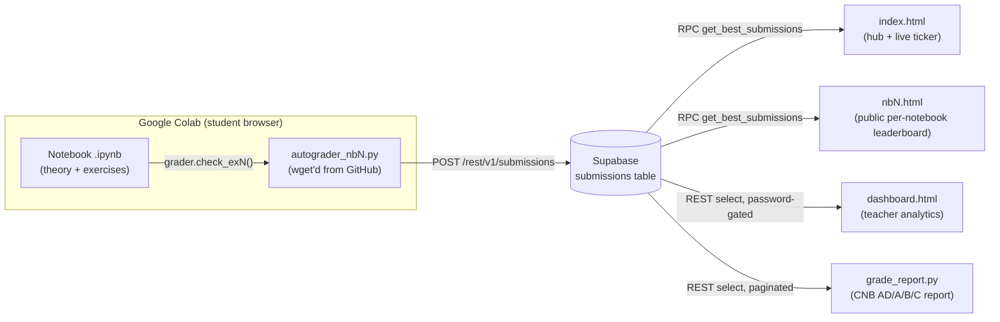

# Course Template & Handoff Guide

**Purpose:** This document captures the architecture, conventions, and design system behind
"Python Quest" (NB1–NB3) so a future agent or developer can stand up a **new programming
course/notebook line** in the same style — gamified, Colab-native, autograded, with live
public leaderboards and a teacher dashboard — without having to reverse-engineer it from the
existing notebooks.

Institution context: I.E. Santa María de los Andes, Cusco, Peru. All
student-facing text is Spanish; code/identifiers are English. Students are 3rd–5th secondary
(ages 15–17).

---

## 1. System architecture



Five moving pieces, all decoupled through one Supabase table:

1. **Notebook** (`.ipynb`, generated by a `build_nbN.py` script) — the student-facing lesson.
   Runs in Google Colab.
2. **Autograder** (`autograder_nbN.py`) — a standalone `.py` file hosted on GitHub, pulled into
   the Colab runtime with `!wget`, imported, and instantiated once per session. It grades
   exercises, tracks XP/levels/achievements, and POSTs the final score to Supabase.
3. **Supabase backend** — one Postgres table (`submissions`) holds every attempt from every
   student across every notebook. RLS allows anonymous insert (autograder) and anonymous
   select (public leaderboards).
4. **Dashboards** — static HTML files (`index.html`, `nb1/2/3.html`, `dashboard.html`) that
   read Supabase client-side via `@supabase/supabase-js`, no backend server. Hosted on GitHub
   Pages.
5. **CNB grade report** (`grade_report.py`) — an offline script a teacher runs locally; maps
   autograder exercise keys to the institution's official checklist criteria and produces an
   AD/A/B/C report per student.

**Nothing here requires a server you deploy.** The only "backend" is Supabase (BaaS) and GitHub
(static hosting + raw file CDN for the autograder). This is a hard constraint worth preserving
for a new course — it's what lets this run entirely on GitHub Pages + a free Supabase tier.

---

## 2. The WORKFORCE team — use it, don't skip it

`WORKFORCE/01_SOFIA.md`, `02_PIXEL.md`, `03_ATLAS.md`, `04_GAUSS.md` already define four
specialist personas this repo was built with. **A future agent building a new course should
adopt these roles in sequence rather than freelancing the design:**

| Agent | Owns | Must NOT touch |
|---|---|---|
| **SOFIA** | Pedagogical goal, CNB compliance, exercise sequencing, learning objectives | Visual theme, autograder code |
| **PIXEL** | Theme/narrative, color palette, level names, achievement design, dashboard aesthetics | Exercise content, grading logic |
| **ATLAS** | Autograder correctness, scoring arithmetic, test cases, Supabase payload integrity | Exercise content, theme |
| **GAUSS** | Statistical/content accuracy of explanations, interpretation keys, datasets | Exercise structure, theme, autograder/scoring code |

Read all four files in full before starting. Their "Outputs and Deliverables" sections
contain ready-made templates (Theme Brief, Exercise Validation Report, Autograder Rewrite Spec,
Statistical Accuracy Review Report) — use those templates literally when designing a new
notebook. The order that has worked here: **SOFIA defines the section/exercise structure →
GAUSS vets statistical accuracy of content and datasets → PIXEL themes it → ATLAS validates and
builds the grader → build script assembles the `.ipynb`.** (GAUSS's role is specific to content
with statistical/technical claims to verify — for a non-quantitative course, this step may not
apply.)

---

## 3. Repo & file-naming conventions

For a course unit called `nbN` (adjust prefix for a new course, e.g. `nbA`, `week2`, etc.):

| File | Role |
|---|---|
| `build_nbN.py` | Generates `nbN_<theme_slug>.ipynb` from Python string literals (theory markdown + code cells). Run locally, not in Colab. |
| `nbN_<theme_slug>.ipynb` | The built notebook — this is what students open in Colab. **Generated artifact**; edit `build_nbN.py` and regenerate rather than hand-editing the `.ipynb` (hand-edits get lost on next rebuild). |
| `autograder_nbN.py` | Grading logic + Supabase submission + gamification HTML rendering. Lives in the repo, but the **canonical distribution copy is on GitHub raw** (see §7) — pushing to `main` is what ships it to students. |
| `nbN.html` | Public, unauthenticated leaderboard for that notebook. Polls Supabase every 60s (not real-time push — see §9). |
| `index.html` | Hub page: quest-card grid linking to each `nbN.html`, plus an aggregate live ticker. |
| `dashboard.html` | Single file covering **all** notebooks — password-gated teacher view with KPIs/charts/heatmap/CSV export. Not per-notebook. |
| `grade_report.py` | CLI, run locally by a teacher: `python grade_report.py nbN --csv out.csv --html out.html`. Not deployed. |
| `_test_*.py` | Ad hoc validation scripts ATLAS-style checks were run with. Not a formal test suite — pattern is "write a throwaway script that imports the autograder and asserts each `check_*` behaves," not pytest. |

New course checklist for names: pick a short `nb`-style prefix, a `theme_slug`, and keep the
1:1 file mapping above. Don't collapse the build script and the notebook into one file — the
separation is what makes regenerating a notebook after a wording fix safe (memory:
`project_notebook_structure` — the same reasoning is *why* the autograder must also be a
separate `.py`, not `%%writefile`'d from inside the notebook: `%%writefile` never executes the
cell in-kernel, so nothing after the write actually runs).

---

## 4. Pedagogical pattern

**Rule: theory → immediate mini-exercise → check → next theory.** Never dump all theory then
all exercises. Every new concept gets its own mini-exercise before moving on. This is
established convention, not a suggestion — see `WORKFORCE/01_SOFIA.md` MODE 2 and
`project_notebook_structure` memory.

### Icon legend (reused verbatim across notebooks — keep it for consistency)

Defined once near the top of every notebook (`build_nb3.py:18-38` is the canonical copy):

| Icon | Tag | Student action |
|---|---|---|
| 👀 | OBSERVA | Run and observe only — don't change anything |
| ✏️ | MODIFICA | Edit and re-run |
| 🔮 | PREDICE | Write a prediction *before* running |
| 🧩 | COMPLETA | Replace `___` with the correct value |
| 🔨 | CONSTRUYE | Write code from scratch |
| 🔧 | DEBUG | Run, read the error, fix it |
| ✅ | VERIFICA | Autograder checks the answer |
| ❓ | TEORÍA | Multiple-choice comprehension question |

### Exercise taxonomy (drives both notebook structure and autograder method names)

- `check_exN` — core exercises, one per concept introduced in that section.
- `check_debugN` — a working demo deliberately broken; student fixes it. High pedagogical value
  for building error-reading skill; keep at least 3-4 per notebook.
- `check_tN` — theory/multiple-choice checks (`respuesta_tN = "?"` variable pattern).
- `check_mini_X` (a, b, c, ...) — section checkpoint. Displays a summary but usually carries
  **no XP of its own** — it exists to gate progress and feed an achievement (e.g. "completed
  all checkpoints"), not to double-score exercises already graded individually.
- `check_intexN` — Part 2 "integration exercises": combine multiple concepts from the whole
  notebook. Scored and *reported* separately from Part 1 mini-exercises (see §10) because
  isolated-concept mastery and integration/transfer are different skills worth tracking
  independently.
- `check_retoN` — optional bonus ("reto" = challenge). Scored separately from the core total
  (`_CORE_MAX` vs `_BONUS_MAX`, see §6) so bonus completion never inflates the base percentage
  used for level thresholds.
- `resumen()` — always the final cell. Prints the full scorecard, submits to Supabase, shows
  achievements.

---

## 5. Gamification & visual design system

### Fixed mechanics (do not vary per theme)

These numbers are identical across NB1/NB2/NB3 (verified in `autograder_nb1_v2.py`,
`autograder_nb2.py`, `autograder_nb3.py`) — treat them as the house rule, not per-notebook taste:

**6-tier level curve by % of core score:**

| Threshold | Tier # |
|---|---|
| 0% | 1 |
| 21% | 2 |
| 41% | 3 |
| 61% | 4 |
| 81% | 5 |
| 96% | 6 |

Only the *names* and emoji change per theme. Examples already in this repo:

| Tier | NB1 (generic fantasy) | NB2 (God of War) | NB3 (TLOU/epidemics) |
|---|---|---|---|
| 1 | 👾 Engendro del Código | 💀 Simple Mortal | ☠️ Paciente 0 |
| 2 | ⚗️ Alquimista de Variables | ⚔️ Espartano | 🧪 Expuesto |
| 3 | 🔮 Hechicero Codicioso | 🛡️ Comandante de Legiones | 🌿 Sobreviviente |
| 4 | 🐉 Domador de Programas | 🔱 Semidiós | 🔦 Firefly |
| 5 | ⚡ Archimago del Caos | ⚔️ Dios de la Guerra | 🧬 Portador |
| 6 | 💎 Dios del Código Eterno | 👻 Fantasma de Esparta | ⚡ Inmune |

**Scoring split:** `_CORE_MAX` (core exercises, drives level %) is always separate from
`_BONUS_MAX` (retos). A student who skips every bonus can still reach tier 6. Bonus XP is
reported but never folded into the percentage that determines level.

**Achievement pattern** (`_unlock(key)` returns `True` only the first time a key is set — see
`autograder_nb2.py:341-345`): every notebook has an equivalent set of "first XP earned",
"perfect score on a themed set of exercises", "N-exercise streak" (thresholds of 3 and 5 seen
in practice), "100% completion", and "bonus completed" achievements. Keep this *shape* — swap
only the names/flavor.

**Deadline handling:** `_DEADLINE_UTC` is a hardcoded `datetime` with tzinfo=UTC in the
autograder. Peru is UTC-5, so "June 14 11:59 PM Peru" → store as `2026-06-15 04:59 UTC`.
`DEADLINE_PASSED` is computed once at import time and gates `_submit_to_supabase` (no
submissions accepted after deadline — grading still runs, feedback still shows, but the score
never reaches the leaderboard/gradebook).

### Theme-specific (design fresh per course, using PIXEL's process)

Use `WORKFORCE/02_PIXEL.md`'s **Theme Brief** template verbatim
(`WORKFORCE/02_PIXEL.md:118-150`) to lock these before writing any code:

- Narrative frame (the world, the student's role in it)
- 5-color palette (background / primary / accent / text / secondary — hex codes, not vague
  names)
- 6 level names following the tier table above
- Achievement names + trigger + one-line flavor text
- In-theme section headers
- 2-3 flavor text examples

Constraints that apply regardless of theme (from `WORKFORCE/02_PIXEL.md`):
- Must render legibly on a **white background** — Colab's default theme is light, dark mode is
  not guaranteed.
- No external asset dependencies beyond fonts/CDNs with graceful fallback (autograders render
  via `IPython.display.HTML`, no bundler, no build step).
- Flavor text ≤3 sentences per section intro — students are there to code.
- Age-appropriate for 12-17, culturally resonant for Peru specifically before global references.

**Note on CSS convention:** existing dashboards (`nb1.html`, `nb2.html`) hardcode hex values
inline per element rather than using CSS custom properties. PIXEL's own spec recommends a
`:root { --bg-primary: ...; }` variable block instead — **prefer that for a new course**, it's
strictly easier to theme-swap and matches PIXEL's "Dashboard Color Spec" deliverable format.

---

## 6. Autograder architecture

One `Autograder` class per notebook, instantiated once (`grader = Autograder()`), holding all
state in `self._scores` — a dict keyed by exercise name, not a running total. This is
deliberate: re-running a cell (which students do constantly) overwrites that key's entry
instead of double-counting it.

Stripped-down skeleton (mirrors `autograder_nb2.py`'s real structure — fill in `<...>`):

```python
"""
Autograder — Notebook N: <topic>
<THEME emoji>  <THEME NAME> — <one-line flavor>
"""
import sys
import datetime as _dt
from IPython.display import HTML, display

# ─── Supabase Config (same project as other courses — see §8) ──
SUPABASE_URL      = "https://uwykikwutjtkpffwmdiq.supabase.co"
SUPABASE_ANON_KEY = "sb_publishable_aBG6GD4wn9CgpSE-47fagQ_sNhnzznu"
LOGO_URL          = "https://raw.githubusercontent.com/Santa-Maria-de-los-Andes/CS1---Grader/main/icono%20SMA.png"

# ─── Deadline: <local time> Peru (UTC-5) = <UTC time> ───────────
_DEADLINE_UTC   = _dt.datetime(2026, 1, 1, 4, 59, 0, tzinfo=_dt.timezone.utc)
DEADLINE_PASSED = _dt.datetime.now(_dt.timezone.utc) >= _DEADLINE_UTC

# ─── Scoring ─────────────────────────────────────────────────
_BONUS_KEYS = {"reto1", "reto2"}
_BONUS_MAX  = 12
_CORE_MAX   = 124   # sum of every non-bonus check's max_pts — verify this matches (§ below)

# ─── Levels (6-tier curve, see §5) ──────────────────────────────
_LEVELS = [
    (96, 6, "<tier6 name>"),
    (81, 5, "<tier5 name>"),
    (61, 4, "<tier4 name>"),
    (41, 3, "<tier3 name>"),
    (21, 2, "<tier2 name>"),
    (0,  1, "<tier1 name>"),
]

def _level_info(pct):
    for thresh, num, name in _LEVELS:
        if pct >= thresh:
            return num, name
    return 1, _LEVELS[-1][2]

def _get(name):
    """Reads a student-defined variable out of the notebook's global namespace."""
    try:
        import __main__
        return getattr(__main__, name, None)
    except Exception:
        return None


class Autograder:
    def __init__(self):
        try:
            sys.stdout.reconfigure(encoding='utf-8')
        except AttributeError:
            pass
        self._scores       = {}   # {key: (earned, possible)}
        self._achievements = set()
        self._streak       = 0
        self._dni = self._nombre_real = self._grado = None
        self._show_registration_form()   # collects dni/nombre/grado, shows best prior score

    def _totals(self):
        core_earned = sum(e for k, (e, _) in self._scores.items() if k not in _BONUS_KEYS)
        pct = min(round(core_earned / _CORE_MAX * 100), 100)
        return pct

    def _unlock(self, key):
        """Returns True only the first time this achievement is granted."""
        if key not in self._achievements:
            self._achievements.add(key)
            return True
        return False

    def _award(self, key, checks, max_pts):
        """checks: list of (passed: bool, label: str, detail: str). Renders feedback,
        stores self._scores[key], updates streak, checks achievement unlocks."""
        passed = sum(1 for ok, _, _ in checks if ok)
        pts = round(max_pts * passed / len(checks)) if checks else 0
        self._scores[key] = (pts, max_pts)
        self._streak = self._streak + 1 if pts == max_pts else 0
        # ... render HTML feedback for each check, call self._check_achievements(key) ...
        return pts == max_pts

    def check_ex1(self):
        """Ex1 — <name>: <what's graded> (N pts)"""
        checks = []
        value = _get("<expected_variable_name>")
        if value is None:
            checks.append((False, "<var>", "No definida — ¿ejecutaste la celda?"))
        elif not isinstance(value, <expected_type>):
            checks.append((False, "<var>", f"Debe ser {<expected_type>.__name__}, recibí {type(value).__name__}"))
        else:
            checks.append((True, "<var> tipo correcto", "✓"))
            # ... additional assertions ...
        return self._award("ex1", checks, <max_pts>)

    # ... check_ex2..N, check_debug1..N, check_t1..N, check_mini_a..X,
    #     check_intex1..N, check_reto1..N ...

    def _submit_to_supabase(self, earned, possible, pct, lvl_num, lvl_name, silent=False):
        if DEADLINE_PASSED or not self._dni:
            return
        import json as _json, urllib.request as _ur
        payload = _json.dumps({
            "email": self._dni, "dni": self._dni,
            "nombre": self._nombre_real or "estudiante",
            "grado": self._grado or "",
            "notebook": "nbN",          # ← this course's unit ID
            "course": "<course_slug>",  # ← NEW discriminator, see §8
            "earned": earned, "possible": possible, "pct": pct,
            "level_num": lvl_num, "level_name": lvl_name,
            "achievements": list(self._achievements), "streak": self._streak,
            "score_breakdown": {k: {"e": e, "p": p} for k, (e, p) in self._scores.items()},
        }).encode("utf-8")
        req = _ur.Request(
            f"{SUPABASE_URL}/rest/v1/submissions", data=payload,
            headers={"apikey": SUPABASE_ANON_KEY,
                     "Authorization": f"Bearer {SUPABASE_ANON_KEY}",
                     "Content-Type": "application/json",
                     "Prefer": "return=minimal"},
            method="POST",
        )
        with _ur.urlopen(req, timeout=12):
            pass

    def resumen(self):
        """Final cell. Prints full scorecard, submits score, shows achievements."""
        pct = self._totals()
        lvl_num, lvl_name = _level_info(pct)
        core_earned = sum(e for k, (e, _) in self._scores.items() if k not in _BONUS_KEYS)
        self._submit_to_supabase(core_earned, _CORE_MAX, pct, lvl_num, lvl_name)
        # ... render themed HTML summary card, list unlocked achievements ...
```

**Before shipping, ATLAS-style validation is non-negotiable** (`WORKFORCE/03_ATLAS.md` MODE 2):
for every `check_*`, test (1) the correct solution passes, (2) the most common wrong approach
fails, (3) a hardcoded/lazy literal answer fails, and confirm `sum(max_pts across all check_*
calls not in _BONUS_KEYS) == _CORE_MAX` exactly — a mismatch here silently breaks the level
curve.

**Registration form:** `_show_registration_form()` (see `autograder_nb2.py:103+`) uses
`google.colab.output` to render an HTML form collecting `dni`/`nombre`/`grado`, then queries
Supabase for that DNI's best prior score on this `notebook` and displays it — this is what lets
a student see "your current best" before attempting again. Reuse this pattern; it's what makes
`dni` (not email) the actual student identity key throughout the system (see §8).

---

## 7. Hosting & distribution

The autograder is **not** bundled into the notebook. It's a separate `.py` file, pushed to a
dedicated GitHub repo (`Santa-Maria-de-los-Andes/CS1---Grader`), and pulled at runtime:

```python
# First cell students run:
!wget -q https://raw.githubusercontent.com/Santa-Maria-de-los-Andes/CS1---Grader/main/autograder_nbN.py
from autograder_nbN import Autograder
grader = Autograder()
```

This means **shipping a grading fix is a `git push` to that repo** — no notebook redistribution
needed, since every student's Colab session re-downloads the file fresh each run.

⚠️ **Known gap, verified against current code:** `build_nb3.py` (and therefore
`nb3_epidemias.ipynb`) is **missing this `!wget` line** — it goes straight to
`from autograder_nb3 import Autograder` (`build_nb3.py:98-100`). NB1 and NB2's build outputs
have it correctly (`nb1_v2.ipynb` line 58, `nb2_control.ipynb` line 76). Fix this in NB3 before
using it as a copy-paste reference for a new course's build script, or the new notebook will
inherit the same bug (autograder import fails on a fresh Colab runtime with no local file).

For a new course's visualization/helper modules (see NB3's `viz_epidemias.py`, `mapa_brote.py`,
`dashboard_oms.py` as precedent), the same `!wget` pattern applies — one line per module, all
from the same raw-hosting repo.

---

## 8. Supabase backend

### Current schema (`supabase_schema.sql`)

```sql
CREATE TABLE public.submissions (
  id uuid DEFAULT gen_random_uuid() PRIMARY KEY,
  email text NOT NULL DEFAULT '',
  dni text, nombre text, grado text,
  notebook text NOT NULL DEFAULT 'nb1',
  earned integer NOT NULL, possible integer NOT NULL, pct integer NOT NULL,
  level_num integer NOT NULL, level_name text NOT NULL,
  achievements text[] DEFAULT '{}', streak integer DEFAULT 0,
  score_breakdown jsonb DEFAULT '{}',
  submitted_at timestamptz DEFAULT now()
);
-- RLS: anon INSERT allowed (autograder), anon SELECT allowed (public leaderboards)
```

`dni` is the real student identity key (best-attempt dedup, grade_report.py lookups) —
`email` is legacy/mostly empty in practice. A `students` table exists (email → full_name/grade)
but is effectively superseded by the autograder's registration form collecting
`nombre`/`grado` directly into `submissions`.

### Adding a second course (decision: same project, new discriminator column)

`notebook` currently distinguishes *units within* Python Quest (`nb1`/`nb2`/`nb3`). For a new
course, add a sibling `course` column rather than overloading `notebook` or spinning up a new
Supabase project:

```sql
ALTER TABLE public.submissions ADD COLUMN IF NOT EXISTS course text NOT NULL DEFAULT 'python_quest';
CREATE INDEX IF NOT EXISTS idx_submissions_course_notebook_pct
  ON public.submissions (course, notebook, pct DESC, submitted_at DESC);
```

Every existing row backfills to `'python_quest'` automatically via the `DEFAULT`. A new
course's autograders set `"course": "<new_course_slug>"` in their `_submit_to_supabase` payload
(already stubbed in the §6 skeleton) and keep using `notebook` for their own internal units
(`unitA`, `unitB`, ... or whatever numbering fits).

### ⚠️ Undocumented piece: `get_best_submissions` RPC

Every dashboard calls `db.rpc('get_best_submissions', { nb: 'nbN' })` (e.g. `nb1.html:736`,
`index.html:425`), but **its SQL definition is not in `supabase_schema.sql` or anywhere else in
this repo** — it only exists live inside the Supabase project's SQL editor. Based on observed
call sites and the fields consumed downstream (`nb1.html:629-650`: `nombre`, `email`, `grado`,
`pct`, `earned`, `level_num`, `level_name`, `achievements`, `streak`, `submitted_at`), it is a
`SECURITY DEFINER` function that returns one best-scoring row per student for a given
`notebook`. **Before building a new course's leaderboard, pull the live definition from
Supabase (`SELECT pg_get_functiondef('get_best_submissions'::regproc)`) and commit it to
`supabase_schema.sql`**, extending its signature to accept `course` alongside `nb` so it filters
correctly once multiple courses share the table. Don't assume a signature — verify it live.

---

## 9. Leaderboards & dashboards

- **`index.html` (hub):** static quest-card grid, one card per notebook, each showing a live
  stat pill (`players / top% / avg%`) fetched via `get_best_submissions` on page load, plus a
  scrolling ticker. No auth.
- **`nbN.html` (per-notebook leaderboard):** full ranked list, filterable by `grado`, auto-
  refreshes via `loadLeaderboard()` on a **60-second `setInterval` poll**
  (`nb1.html:762-779`) — this is client-side polling, *not* a Supabase Realtime subscription.
  Keep that framing accurate in any docs/marketing: "live" means ≤60s stale, not push-based.
  `persistSession:false` is set explicitly since this is a public unauthenticated page.
- **`dashboard.html` (teacher):** single page covering every notebook via tabs
  (`setNotebook()`/`setGrade()`), password-gated client-side (`DASHBOARD_PASSWORD` constant,
  `dashboard.html:580` — **this is security-through-obscurity, not real auth**; fine for a
  low-stakes internal tool, worth flagging if a new course has any higher-stakes data). Renders
  KPIs, per-exercise difficulty bars, a heatmap, alert lists, and CSV export
  (`dashboard.html:611-1187`).

For a new course reusing this pattern: build the per-unit leaderboard and hub card first (cheap,
high student motivation payoff), teacher dashboard can follow once there's enough submission
volume to make the analytics meaningful.

---

## 10. CNB grade report (`grade_report.py`)

Separate from the gamified dashboards — this produces the institution's official AD/A/B/C
checklist report a teacher submits for CNB compliance. Run locally:

```
python grade_report.py nbN --csv reporte_nbN.csv --html reporte_nbN.html
```

Key design, worth preserving for a new course's `CRITERIA` dict (`grade_report.py:47-79`):

- Each row in `CRITERIA[notebook]` is `(criterion_name, [check_* keys that feed it], kind)`.
- `kind='skill'` → graded AD/A/B/C by **correctness** (earned/possible points, thresholds at
  90/75/50%).
- `kind='effort'` → graded Completo/Parcial/Ninguno by **how many were attempted** (key present
  in `score_breakdown`), regardless of correctness — this is specifically for criteria like
  "seeks out the bonus challenges," where attempting demonstrates the trait, not solving.
- Part 1 (isolated mini-exercises) and Part 2 (`intex*` integration exercises) are **always
  separate criteria**, never merged — isolated concept mastery and transfer/integration are
  different skills and diluting one into the other loses signal.
- `MANUAL_CRITERIA` (`grade_report.py:85-88`) lists criteria that can't be derived from
  autograder output at all (e.g. "reads instructions carefully") — these ship as blank columns
  in the report for the teacher to fill in by hand. Don't try to infer these programmatically.
- Best-attempt-per-student dedup is by `dni`, tie-broken by most recent `submitted_at`
  (`grade_report.py:126-138`).

When designing a new course, get the **actual CNB/institutional checklist wording** from
SOFIA's domain (or the relevant teacher) first, then map `check_*` keys to it — don't invent
criteria names. Each criterion should map to something the autograder can actually measure.

---

## 11. Build scripts (`build_nbN.py`)

Notebooks are generated, not hand-written in Jupyter, so wording fixes are diffable and the
autograder methods stay in sync with cell IDs. Pattern (`build_nb3.py`):

```python
def md(cell_id, source):
    return {"cell_type": "markdown", "id": cell_id, "metadata": {}, "source": source}

def code(cell_id, source):
    return {"cell_type": "code", "id": cell_id, "metadata": {}, "source": source,
            "outputs": [], "execution_count": None}

cells = []
cells.append(md("nbN-title", """# <title>\n\n**Temas:** ...\n\n<icon legend table>"""))
cells.append(code("nbN-data", """<any provided data lists>"""))
cells.append(code("nbN-setup", """\
!wget -q https://raw.githubusercontent.com/Santa-Maria-de-los-Andes/CS1---Grader/main/autograder_nbN.py
from autograder_nbN import Autograder
grader = Autograder()"""))

# ... one md() + code() pair per theory block / exercise / grader.check_*() cell,
#     following the OBSERVA→MODIFICA→PREDICE→COMPLETA cadence from §4 ...

cells.append(md("nbN-final-header", "---\n## 🏁 Puntaje Final"))
cells.append(code("nbN-resumen", "grader.resumen()"))

nb = {
    "nbformat": 4, "nbformat_minor": 5,
    "metadata": {
        "kernelspec": {"display_name": "Python 3", "language": "python", "name": "python3"},
        "language_info": {"name": "python", "version": "3.10.0", ...},
    },
    "cells": cells,
}
with open("nbN_<theme>.ipynb", "w", encoding="utf-8") as f:
    json.dump(nb, f, ensure_ascii=False, indent=1)
print(f"OK: nbN_<theme>.ipynb generado - {len(cells)} celdas")
```

Cell `id` naming convention: `<nb-prefix>-<section>-<element>[-md|-check|-exp]`, e.g.
`nb3-32-ej3-check`. Keeps grep-ability when cross-referencing a notebook against its
autograder's `check_*` methods.

---

## 12. Standing up a new course — ordered checklist

1. **SOFIA pass:** define topic, learning objectives, section structure, exercise list per
   section (what each exercise teaches, not yet how it's themed or graded).
2. **PIXEL pass:** produce a Theme Brief (§5) — palette, level names, achievement system,
   narrative frame. Get palette/level-name approval before writing code (PIXEL's own
   constraint: "Lock design decisions without user approval on palette and level names" is a
   Must NOT).
3. **ATLAS pass:** for each exercise, define exact expected output/variable name, points, and
   at least 3 test cases (correct / common-wrong / hardcoded). Confirm the point sum equals a
   declared `_CORE_MAX` before writing a single `check_*`.
4. **Write `autograder_nbN.py`** from the §6 skeleton. Wire in the theme's colors/level names/
   achievement copy. Set `course` in the Supabase payload (§8). Test every `check_*` per
   ATLAS's cases.
5. **Write `build_nbN.py`** from the §11 skeleton, interleaving theory/exercise/check per §4.
   **Include the `!wget` line for the autograder itself** (§7 — don't repeat the NB3 gap).
   Run it to produce the `.ipynb`.
6. **Push `autograder_nbN.py`** to the `Santa-Maria-de-los-Andes/CS1---Grader` GitHub repo
   (or wherever raw-hosting lives for the new course) so the `!wget` URL resolves.
7. **Supabase:** apply the `course` column migration if not already applied (§8); pull and
   commit the live `get_best_submissions` definition, extended for `course` filtering.
8. **Build `nbX.html`** leaderboard from the `nb1.html` pattern (§9): themed CSS, 60s poll,
   `grado` filter, `db.rpc('get_best_submissions', { nb: '<unit>', course: '<course_slug>' })`.
9. **Add a quest card to `index.html`** for the new course/unit, or spin up a parallel hub if
   it's a fully separate course rather than an additional Python Quest unit.
10. **Extend `dashboard.html`** tabs and `grade_report.py`'s `CRITERIA` dict for the new
    course, once real submission data exists to validate against.
11. **Dry run end-to-end** as a fake student in an incognito Colab session before assigning to
    real students: wget resolves, registration form submits, leaderboard updates within 60s,
    resumen() renders correctly.

---

## 13. Known gaps to resolve, not to copy forward

- `nb3_epidemias.ipynb` / `build_nb3.py` missing the autograder `!wget` line (§7) — a real bug
  in the current repo, not a convention.
- `get_best_submissions` RPC has no source-controlled definition (§8) — reconstruct and commit
  it before depending on its exact behavior.
- `dashboard.html`'s password gate is a client-side string compare, not real auth (§9) — fine
  for current stakes, call it out explicitly if a new course has higher-stakes grading data.
- `students` table in `supabase_schema.sql` appears vestigial given the registration form now
  collects `nombre`/`grado` inline per submission — confirm with whoever owns Supabase whether
  it's still used before assuming it needs populating for a new course.
